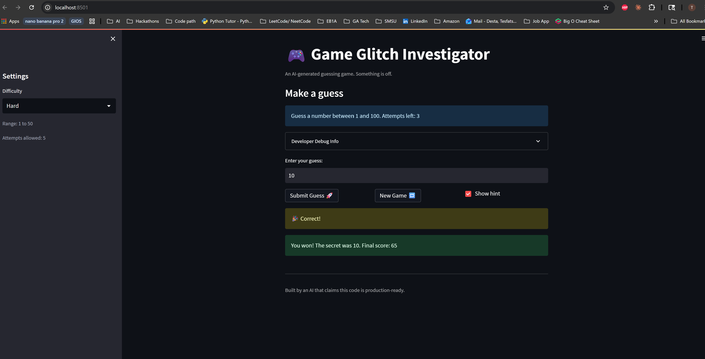
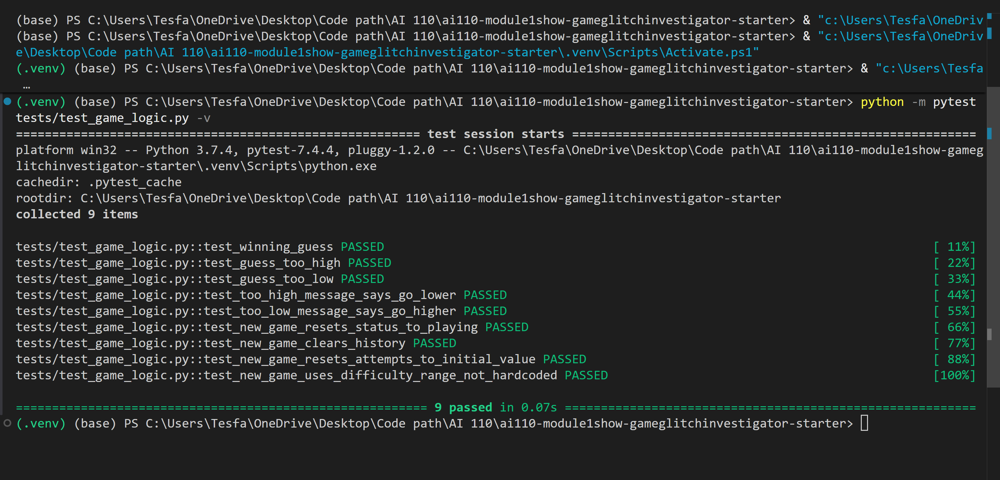

# 🎮 Game Glitch Investigator: The Impossible Guesser

## 🚨 The Situation

You asked an AI to build a simple "Number Guessing Game" using Streamlit.
It wrote the code, ran away, and now the game is unplayable. 

- You can't win.
- The hints lie to you.
- The secret number seems to have commitment issues.

## 🛠️ Setup

1. Install dependencies: `pip install -r requirements.txt`
2. Run the broken app: `python -m streamlit run app.py`

## 🕵️‍♂️ Your Mission

1. **Play the game.** Open the "Developer Debug Info" tab in the app to see the secret number. Try to win.
2. **Find the State Bug.** Why does the secret number change every time you click "Submit"? Ask ChatGPT: *"How do I keep a variable from resetting in Streamlit when I click a button?"*
3. **Fix the Logic.** The hints ("Higher/Lower") are wrong. Fix them.
4. **Refactor & Test.** - Move the logic into `logic_utils.py`.
   - Run `pytest` in your terminal.
   - Keep fixing until all tests pass!

## 📝 Document Your Experience

**Game purpose:** A number guessing game where the player tries to guess a secret number within a limited number of attempts, with hints pointing them higher or lower each turn.

**Bugs found:**
- Hints were backwards — "Go HIGHER!" showed when the guess was too high, and "Go LOWER!" when too low
- The New Game button didn't reset status, history, score, or use the correct difficulty range
- `st.rerun()` caused an AttributeError in this version of Streamlit
- Logic functions were defined inline in `app.py` instead of `logic_utils.py`, making them untestable without importing Streamlit

**Fixes applied:**
- Swapped the "Go HIGHER!" / "Go LOWER!" messages in `check_guess` so hints are correct
- Fixed the New Game block to fully reset `status`, `history`, `score`, `attempts`, and use `random.randint(low, high)` based on difficulty
- Replaced `st.rerun()` with `st.experimental_rerun()`
- Moved all logic functions into `logic_utils.py` and updated `app.py` to import from there

## 📸 Demo

## ✅ Challenge 1: Advanced Edge-Case Testing

pytest results showing all 9 tests passing:

## 🚀 Stretch Features

- [ ] [If you choose to complete Challenge 4, insert a screenshot of your Enhanced Game UI here]
